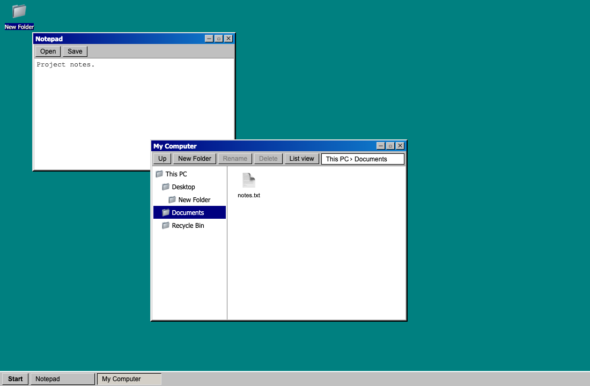
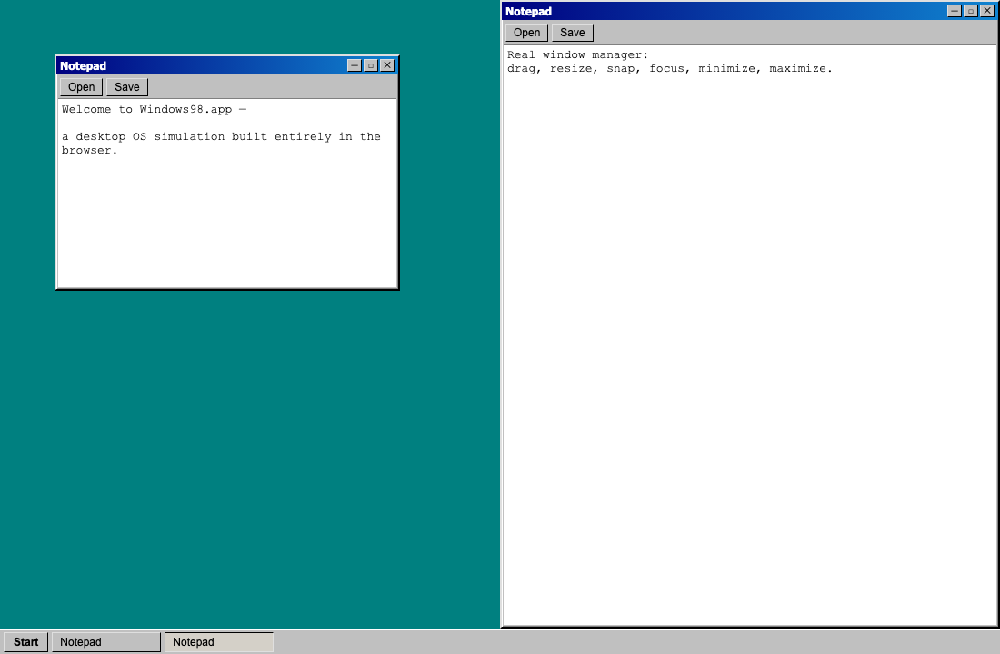
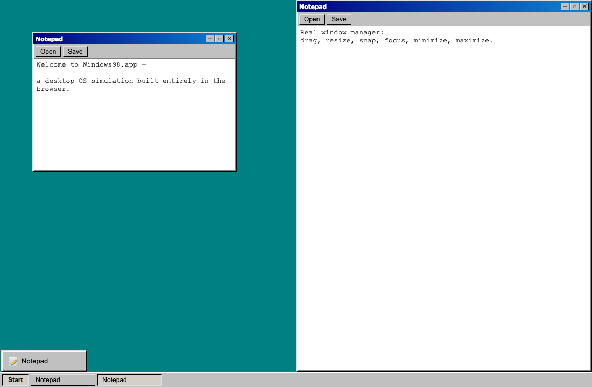
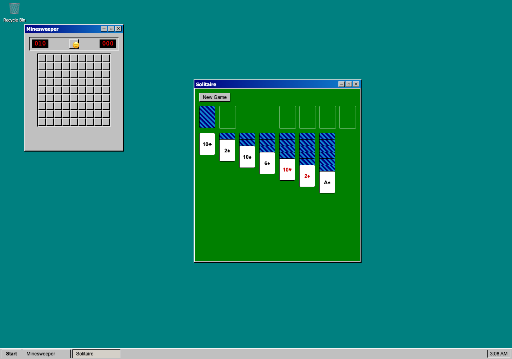
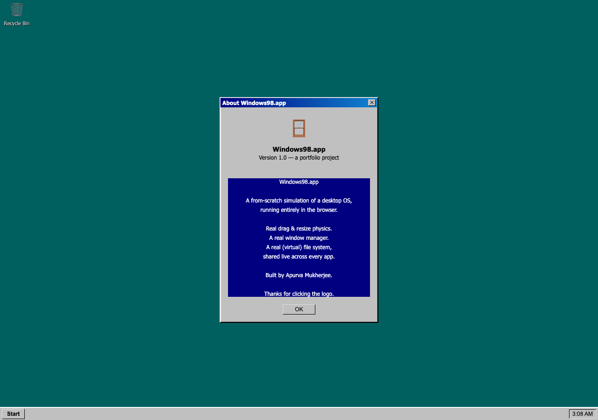

# Windows98.app

A real desktop operating system, simulated entirely in the browser — not a nostalgia skin, an actual window manager. Open apps, drag and resize real windows, snap them to the screen edges, minimize and maximize, and switch between them from a taskbar. Every interaction is built from scratch: no window-manager library, no drag-and-drop library, no UI kit.



## What makes this different from a CSS mockup

Most "recreate an old OS" projects fake the parts that are actually hard. This one doesn't:

- **Dragging is compositor-only.** Windows move via `transform: translate3d()` mutated directly on the DOM node inside a single `requestAnimationFrame` callback per frame — never through React state. Dragging one window causes **zero re-renders of every other window on screen**, verified by an automated test that asserts render counts via React's `Profiler` API, not just eyeballed.
- **Resizing is edge-and-corner accurate.** All eight resize handles (corners and edges) are real, each independently clamped to a minimum size while pinning the correct opposite edge in place — exactly like a real OS, not just a single bottom-right grip.
- **Snapping has a real ghost preview.** Drag a window to a screen edge and a translucent preview shows where it'll land before you release — driven by the same zero-re-render technique as dragging itself.
- **Every window subscribes to only its own state.** The store is sliced per-window (via Zustand selectors), so moving, resizing, minimizing, or maximizing one window never touches the render of any other window, no matter how many are open.
- **A real virtual file system, not per-app fake state.** Notepad, Paint, File Explorer, the Terminal, and the Desktop all read and write the *same* file records. Save a document in Notepad, and it's a real file: browse to it in Explorer, `cat` it from the Terminal, drag it onto the desktop or into the Recycle Bin — every surface is a view over one shared file system.
- **Cross-window drag without a drag-and-drop library.** Dragging a desktop icon onto an open Explorer window, onto another folder icon, or a file out of Explorer onto the desktop is resolved by checking what's actually under the cursor at drop time — the same pointer-drag primitive used for window dragging, reused rather than layering native HTML5 drag-and-drop on top of it.
- **State survives a reload.** Every window, file, icon position, and wallpaper choice is persisted to `localStorage` behind a debounced writer with a synchronous flush on tab-close, so a reload doesn't lose your last few seconds of work.

## Features

- Draggable, resizable windows with authentic Windows 98 chrome
- Focus and z-order stacking that behaves the way a real window manager does
- Minimize, maximize, and restore — including popping a maximized window back to its original size mid-drag
- Aero-Snap-style edge snapping with a live preview
- Ctrl+Tab / Cmd+Tab window switching (real Alt+Tab is an OS-level shortcut a browser page can never intercept)
- A taskbar with a working clock (double-click for Date/Time Properties), taskbar app pinning, and a Start Menu for launching apps and resetting the desktop
- A skippable boot screen and a wallpaper picker — nine backgrounds, from solid colors to original CSS-pattern designs
- Multiple independent instances of the same app at once
- A virtual file system shared across every app: Notepad, Paint, File Explorer, and the Terminal all read and write the same files
- **File Explorer** — folder tree, icon/list views, breadcrumb navigation, create/rename/delete
- **Notepad** — plain text files, Open/Save against the real file system
- **Paint** — pencil, eraser, line, rectangle, and flood fill on a real `<canvas>`, saved as real image files
- **Terminal** — a real shell (`ls`, `cd`, `cat`, `mkdir`, `touch`, `rm`, `echo`, `open`, `clear`, `help`) against the same file system every other app uses, with command history and persistent scrollback
- **Minesweeper** — classic rules: first click is never a mine, flood-fill reveal, flagging, timer
- **Solitaire (Klondike)** — full ruleset, drag-and-drop cards (and valid multi-card runs) built on the same drag primitive as everything else in the app
- Real desktop icons, including a Recycle Bin: grid-snapped positions, rubber-band multi-select, drag files into it to delete them, right-click to empty it for good
- Your desktop persists — reload the page and every window, file, icon position, and wallpaper is exactly where you left it
- Small-screen mode: below tablet width, windows behave like a mobile app switcher instead of fighting for space
- A handful of things that aren't announced anywhere — this is still Windows 98

## Tech stack

| | |
|---|---|
| **Framework** | React 19 + TypeScript (strict) |
| **Bundler** | Vite |
| **State** | Zustand — chosen specifically for selector-scoped subscriptions, the foundation of the zero-re-render drag model |
| **Testing** | Vitest + React Testing Library for unit/component behavior, Playwright for real pointer-drag and cross-browser interaction |
| **Styling** | Hand-authored CSS Modules — no UI framework, since faithfully reproducing Windows 98's exact bevels and metrics isn't something a modern component kit can do |

No drag-and-drop library, no animation library, no icon library, no canvas library. Every one of those is either free from the browser (native pointer events, CSS transitions, the Canvas 2D API) or small enough to author by hand — and hand-authoring it is the point of the project.

## Screenshots









## Running it locally

```bash
npm install
npm run dev       # start the dev server
npm run test      # unit + component tests
npm run typecheck
npm run lint
npm run build     # production build
```

## Architecture, briefly

- `stores/` — Zustand stores: window geometry/z-order, the virtual file system, desktop icon positions, taskbar pins, per-window app state, and easter-egg state — all deliberately separate so a change in one never triggers a re-render tied to another.
- `hooks/usePointerDrag.ts` — the single primitive every drag interaction in the app is built on (windows, resize handles, desktop icons, rubber-band selection, Solitaire cards): pointer capture, `requestAnimationFrame` batching, and cleanup on `pointercancel`/`blur` so a gesture can never get stuck.
- `window-manager/` — window chrome, resize math, and the snap-zone/ghost-preview logic.
- `desktop/` — desktop icons, grid layout, rubber-band multi-select, and cross-window drop-target resolution.
- `apps/` — self-contained app components (Notepad, Explorer, Paint, Terminal, Minesweeper, Solitaire), each registered once in `APP_REGISTRY` and completely unaware of window mechanics.
- `taskbar/` — taskbar, clock, and Start Menu, derived entirely from the window store with no logic of its own.
- `persistence/` — the debounced `localStorage` writer and the reset-on-schema-mismatch load path.
- `easter-eggs/` — self-contained, additive, and never load-bearing: the app works identically with every file in this folder deleted.
